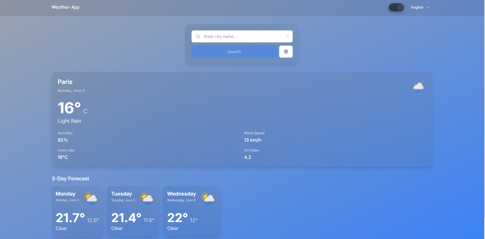

# Weather Forecast App 🌤️

A modern, full-stack weather forecast application built with Nuxt 3 and Vue 3, featuring real-time weather data, beautiful UI, and internationalization support. The application provides both current weather conditions and detailed forecasts for locations worldwide.




## ✨ Features

### Frontend
- 🌍 Real-time weather data display
- 📱 Responsive design for all devices
- 🌙 Dark/Light mode support
- 🌐 Multi-language support (i18n)
- 📊 Detailed weather forecasts
- 🎨 Beautiful UI with Tailwind CSS
- 🔍 Location-based weather search
- 📈 Interactive weather charts
- 🎯 Accurate weather predictions
- 🎭 Smooth animations and transitions

### Backend
- 🔄 Dual backend support (TypeScript & Python)
- ⚡ Fast API responses
- 🔒 Rate limiting protection
- 💾 Response caching
- 🌐 Multi-language support (28 Languages)
- 📍 Location search by city or coordinates
- 🏥 Health check endpoint
- 🔍 Comprehensive error handling

## 🛠️ Tech Stack

### Frontend
- **Framework:** [Nuxt 3](https://nuxt.com/)
- **UI Library:** [Vue 3](https://vuejs.org/)
- **Styling:** [Tailwind CSS](https://tailwindcss.com/)
- **State Management:** [Pinia](https://pinia.vuejs.org/)
- **Icons:** [Font Awesome](https://fontawesome.com/) & [Heroicons](https://heroicons.com/)
- **Internationalization:** [Vue I18n](https://vue-i18n.intlify.dev/)
- **3D Graphics:** [Three.js](https://threejs.org/)
- **TypeScript:** For type safety and better development experience

### Backend
- **TypeScript API:** Nuxt Server API
- **Python API:** Flask
- **Caching:** Redis
- **Rate Limiting:** Custom middleware
- **Error Handling:** Comprehensive error management

## 🚀 Getting Started

### Prerequisites

- Node.js (v16 or higher)
- Python 3.8+ (for Python backend)
- npm or yarn
- Redis (for caching)

### Installation

1. Clone the repository:
```bash
git clone https://github.com/89CF/weather-app.git
cd weather-forecast
```

2. Install frontend dependencies:
```bash
npm install
# or
yarn install
```

3. Set up Python environment (for Python backend):
```bash
python -m venv .venv
source .venv/bin/activate  # On Windows: .venv\Scripts\activate
pip install -r requirements.txt
```

4. Create a `.env` file in the root directory:
```env
# Frontend
NUXT_PUBLIC_API_BASE=http://localhost:3000/api

# Backend
WEATHER_API_KEY=your_api_key_here
REDIS_URL=redis://localhost:6379
```

5. Start the development server:
```bash
# Frontend
npm run dev
# or
yarn dev

# Backend (Python)
python server/app.py
```

6. Open [http://localhost:3000](http://localhost:3000) in your browser.

## 📁 Project Structure

```
weather-forecast/
├── assets/         # Static assets
├── components/     # Vue components
├── composables/    # Vue composables
├── layouts/        # Page layouts
├── middleware/     # Route middleware
├── pages/          # Application pages
├── plugins/        # Vue plugins
├── public/         # Public static files
├── server/         # Backend implementation
│   ├── api/        # API endpoints
│   ├── utils/      # Utility functions
│   └── middleware/ # Backend middleware
├── stores/         # Pinia stores
├── types/          # TypeScript types
└── utils/          # Utility functions
```

## 🌐 Internationalization

The app supports multiple languages. To add a new language:

1. Add your translations in the `i18n` directory
2. Update the `i18n.config.ts` file
3. Add the language to the language selector component

## 🎨 Customization

- Colors and themes can be customized in `tailwind.config.ts`
- Layout components can be modified in the `layouts` directory
- Global styles can be adjusted in the `assets` directory
- API endpoints can be configured in `nuxt.config.ts`

## 🔧 Development

### Available Scripts

```bash
# Development
npm run dev

# Build for production
npm run build

# Preview production build
npm run preview

# Lint code
npm run lint

# Fix linting issues
npm run lint:fix
```

## 🤝 Contributing

Contributions are welcome! Please feel free to submit a Pull Request.

1. Fork the repository
2. Create your feature branch (`git checkout -b feature/AmazingFeature`)
3. Commit your changes (`git commit -m 'Add some AmazingFeature'`)
4. Push to the branch (`git push origin feature/AmazingFeature`)
5. Open a Pull Request

## 📝 License

This project is licensed under the MIT License - see the [LICENSE](LICENSE) file for details.

## 🙏 Acknowledgments

- Weather data provided by [WeatherApi](https://www.weatherapi.com/)
- Icons by [Font Awesome](https://fontawesome.com/) and [Heroicons](https://heroicons.com/)
- Built with [Nuxt 3](https://nuxt.com/) and [Vue 3](https://vuejs.org/)
- Backend powered by [Flask](https://flask.palletsprojects.com/) 